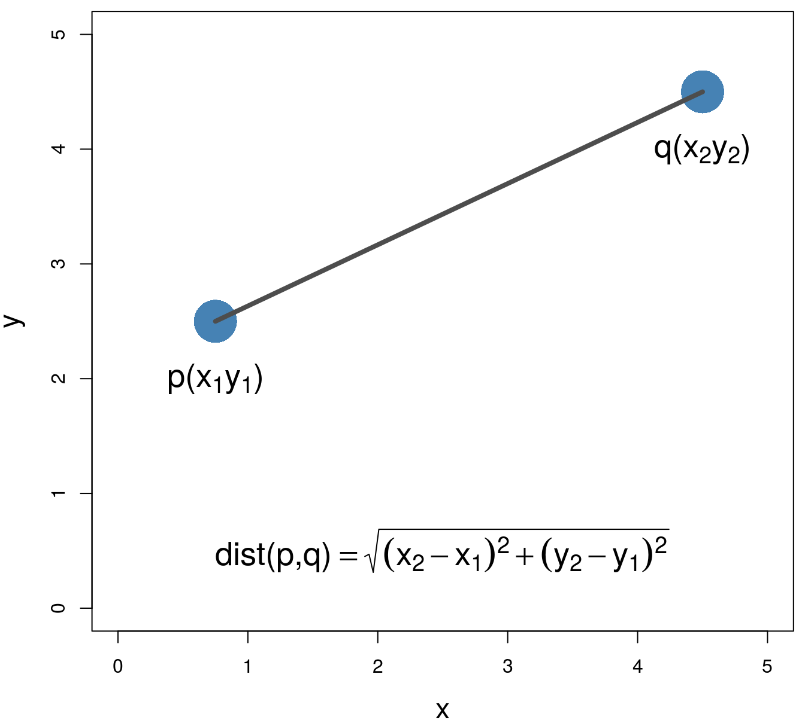

<p align="center">
      
</p>
<h1 align="center"/>Game Of The Bug! (GOTB)</h1>
<p align="center">A fun game that demonstrates basic AI behavior 🐞</p>
<hr>

### Introduction

GOTB is a fun and interactive game inspired by the famous "[Game of Life](https://en.wikipedia.org/wiki/Conway%27s_Game_of_Life)". In this game, we have three types of bugs: rocks (red), papers (blue), and scissors (green). These bugs move around the screen and try to kill each other, and you can set different levels of intelligence (IQ) that affect their behavior.

#### Algorithm

The [Euclidean Distance](https://en.wikipedia.org/wiki/Euclidean_distance) algorithm, calculates to find the closest enemy

<p align="center">
<a href="https://bioinformatics-training.github.io/intro-machine-learning-2019/nearest-neighbours.html">
      
</a>
</p>

### Installation

1. Clone the GOTB repository:

   ```bash
   git clone https://github.com/houshmand-2005/GOTB.git
   ```

2. Navigate to the project directory:

   ```bash
   cd GOTB
   ```

3. Run the game:

   ```bash
   python main.py
   ```

The window will appear, and you can start see GOTB.

<div align="center">

</div>
